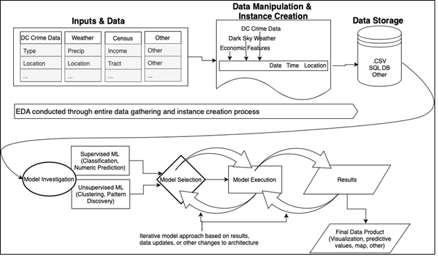

# DC-Criminalistics
Cohort 14  
Georgetown University  
School of Continuing Studies  
Data Science Certificate Capstone Project  

### Team Members:
Greg Barbieri - [@gfbarbieri](https://github.com/gfbarbieri)  
Dan Schorer - [@danschorer](https://github.com/danschorer)  
Tara Brosnan - [@tarabrosnan](https://github.com/tarabrosnan)  

### Folder Organization
**ingest-data-progs**: Programs used to ingest Census, weather, WMATA, and CaBi data. Crime data was pulled directly from DC's Crime Cards application, exported as CSV. Census, weather, WMATA, and CaBi programs store data as SQLite database table.  
**wrangle-data-progs**: Programs used to wrangle, merge, and generate features and targets.
**data**: Data from ingestion and wrangling.  
**notebooks**: Notebooks versions of ingestion and wrangling process, including target generation. Notebooks on exploratory data analysis (EDA), feature standardization, feature selection, machine learning models and output. Notebooks to reproduce graphs for the technical report.  
**report**: Files and external data used in the technical report.  
**model**: Model parameters for prediction and the data product.  
**demo**: Programs used for demonstrating data product.  

### Deliverables
1. Presentation
2. Final Report

## Abstract
>The goal of the project is to use machine learning to predict crime rates. Regardless of available data, it is difficult, if not impractical, to predict whether a particular individual will be a victim of violent or non-violent crime in an area. The team hypothesized that it was possible to predict crime rates by block group in Washington DC using features such as weather, time of day, and location. The team ingested data from the US Census Bureau, DC Metropolitan Police Department, and Dark Sky website. After wrangling, feature generation and target rescaling, the team had about 180,000 instances and 26 features. Feature evaluation limited the selection from 26 to 11 and the team selected 6 features to model crime rates. The team used classification models to predict crime rate buckets of low, low-medium, medium, medium-high, and high. Overall, a bagging classification model with a decision tree estimator outperformed other models tested such as K-Nearest Neighbors and Random Forest models. Overall model accuracy was 82% percent, and all models, including those with economic and demographic data had trouble accurately predicting crime rates in the high category as measured by false negatives and visualized by the confusion matrix, while more certain in predicting crime rates in the medium, medium-high, and medium-low categories.

## Project Overview
**Purpose**: Predict crime rates in Washington, DC and return recommended transportation options in the user-defined geographic area.  
**Target**: Crime rate per 100,000 people by Census block group and time of day.  
**Features**: Block group, day of the month, day of the week, time of day, UV index, average temperature.  

> **Architecture**  
>   

## Data Sources
1. [American Community Survey](https://www.census.gov/programs-surveys/acs) (ACS) and the [ACS API](https://www.census.gov/data/developers/data-sets/acs-5year.html)
2. [DC MPD Crime Cards](https://dcatlas.dcgis.dc.gov/crimecards/)
3. [Dark Sky](https://darksky.net) and the Dark Sky API.

## Methodology
**Ingestion**: Download data from data sources using their API or download directly from their website.  
**Wrangling**: Feature and [target generation](https://github.com/georgetown-analytics/DC-Criminalistics/blob/master/notebooks/Wrangle_Target_Rescaling.ipynb) and feature [standardization](https://github.com/georgetown-analytics/DC-Criminalistics/blob/master/notebooks/Model_Feature_Standardization.ipynb).  
**Machine Learning**: Employ supervised machine learning methods to [select features and model](https://github.com/georgetown-analytics/DC-Criminalistics/blob/master/notebooks/Model_Feature_Selection_Modelling.ipynb).  
